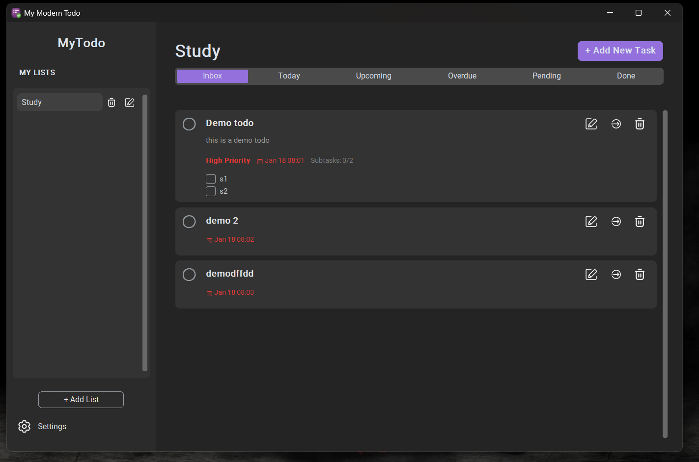
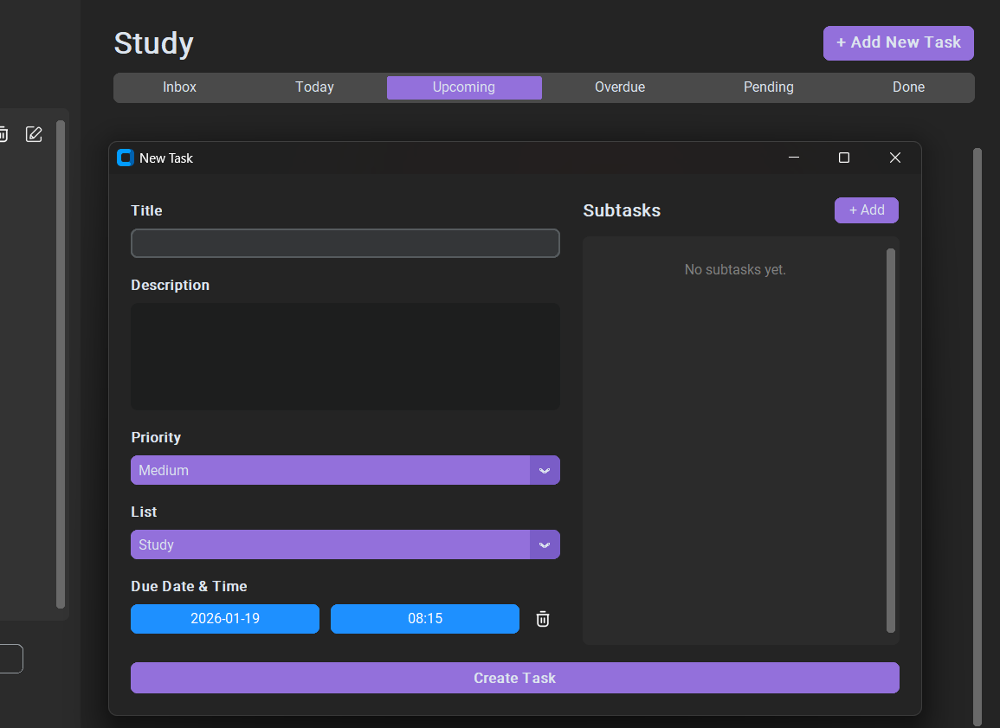
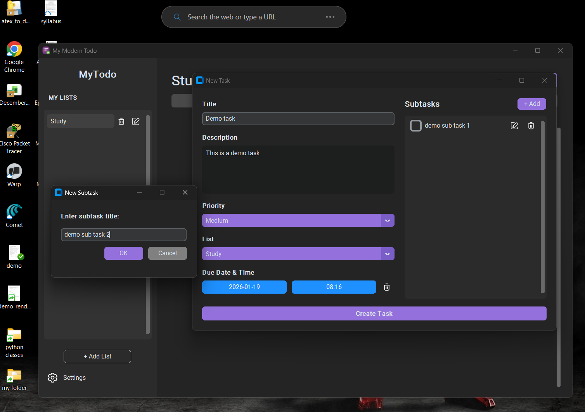

# My Modern Todo

A sleek, modern desktop task management application built with Python. designed to keep you organized with a beautiful interface and powerful features.









# Download
[📥 Download](https://github.com/ssahu200122/MyTodoApp/raw/main/Output/MyTodo_Setup.exe)

Download the latest Installer (Windows) Click the link above to download the MyTodo_Setup.exe installer.

# ✨ Features

- **Modern UI:** Built with CustomTkinter for a clean, responsive aesthetic that supports High-DPI displays.

- **Project-Based Organization:** Create multiple lists (e.g., Personal, Work, Shopping) to categorize your tasks.

- **Smart Filtering:** View tasks by Inbox, Today, Upcoming, Overdue, or Done.

- **Task Details:**

    - Set Due Dates & Times with a visual picker.

    - Add Subtasks to break down complex items.

    - Set Priority Levels (Low, Medium, High).
    
    - Add text descriptions.

- **System Tray Integration:** Minimizes to the system tray so it stays running in the background.

- **Desktop Notifications:** Get native OS notifications when a task is due.

- **Customization:**

    - Toggle Light/Dark Mode.

    - Change Color Themes (Blue, Green, Dark Blue, and custom JSON themes).

- **Data Persistence:** Automatically saves all data to a local SQLite database.

# 🛠️ Built With

- **Python** 3.13+

- **CustomTkinter** - UI Framework

- **SQLAlchemy** - Database ORM

- **APScheduler** - Background Task Scheduling

- **Plyer** - System Notifications

- **Pystray** - System Tray Icon Support

# 🚀 Running from Source (For Developers)

If you want to contribute or run the raw Python code:

Clone the repository

```bash
git clone [https://github.com/ssahu200122/MyModernTodo.git](https://github.com/yourusername/MyModernTodo.git)
cd MyModernTodo
```


Install Dependencies

pip install -r requirements.txt


Run the App

```bash
python main.py
```


# 📦 Building the Executable

To create the .exe file yourself using PyInstaller:

Ensure all dependencies are installed.

Run the build script:

```bash
python build_exe.py
```


The output will be in the dist/MyModernTodo folder.

# 💿 Creating the Installer

To generate the MyTodo_Setup.exe installer:

Download and install Inno Setup from the link provided below:

[Inno Setup](https://jrsoftware.org/isdl.php#stable)

Open setup_script.iss with Inno Setup Compiler.

Click Run.

The installer will be generated in the Output folder.

# 📄 License

Distributed under the MIT License. See LICENSE for more information.

# Developed by Sourabh Apps